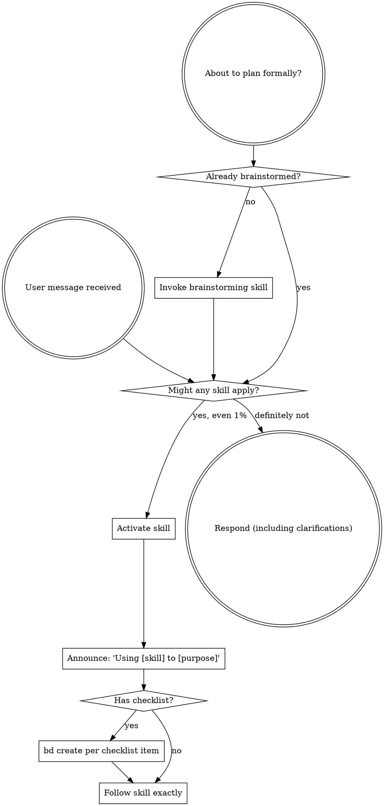

<!-- Derived from obra/superpowers (MIT, © 2025 Jesse Vincent) — rewritten to use bd (beads) as the persistence layer. -->

<SUBAGENT-STOP>
If you were dispatched as a subagent to execute a specific task, skip this skill.
</SUBAGENT-STOP>

<EXTREMELY-IMPORTANT>
If you think there is even a 1% chance a skill might apply to what you are doing, you ABSOLUTELY MUST invoke the skill.

IF A SKILL APPLIES TO YOUR TASK, YOU DO NOT HAVE A CHOICE. YOU MUST USE IT.

This is not negotiable. This is not optional. You cannot rationalize your way out of this.
</EXTREMELY-IMPORTANT>

## Instruction Priority

Superpowers skills override default system prompt behavior, but **user instructions always take precedence**:

1. **User's explicit instructions** (CLAUDE.md, GEMINI.md, AGENTS.md, direct requests) — highest priority
2. **Superpowers skills** — override default system behavior where they conflict
3. **Default system prompt** — lowest priority

If CLAUDE.md, GEMINI.md, or AGENTS.md says "don't use TDD" and a skill says "always use TDD," follow the user's instructions. The user is in control.

## How to Access Skills

**In Claude Code:** Use the `Skill` tool. When you invoke a skill, its content is loaded and presented to you—follow it directly. Never use the Read tool on skill files.

**In Codex:** Skills are discovered from installed plugins and from `.agents/skills` in the current repository. Use `$<skill-name>` or the `/skills` picker for explicit invocation; otherwise follow the skill when Codex activates it implicitly.

**In Copilot CLI:** Use the `skill` tool. Skills are auto-discovered from installed plugins. The `skill` tool works the same as Claude Code's `Skill` tool.

**In Gemini CLI:** Skills activate via the `activate_skill` tool. Gemini loads skill metadata at session start and activates the full content on demand.

**In other environments:** Check your platform's documentation for how skills are loaded.

## Platform Adaptation

Skills use Claude Code tool names. Non-CC platforms: see `references/copilot-tools.md` (Copilot CLI), `references/codex-tools.md` (Codex), and `references/gemini-tools.md` (Gemini CLI) for tool equivalents.

## Beads Availability Check

Before any skill requires a `bd` command, check whether the CLI exists:

```bash
command -v bd >/dev/null 2>&1
```

If `bd` is not installed:

1. Do not run `bd init`.
2. Do not install `bd` automatically.
3. Say that beads-backed persistence is unavailable for this session.
4. Continue without beads if the user wants to proceed, using only
   session-local tracking or the repo's existing tracker.
5. If the user wants beads, give neutral install guidance and do not assume
   global install permissions, maintainer status, or permission to modify the
   repository.

Use this wording as the default:

> I do not see the `bd` CLI on PATH, so I cannot use beads-backed persistence
> in this session. I can continue without beads for this repo/session, or you
> can install `bd` using your preferred local, user-level, or project-approved
> method. I will not initialize or modify this repository for beads unless you
> explicitly ask for that.

Missing `bd` and an uninitialized repository are separate states. If the CLI is
present but no beads workspace is active, handle that as repository setup, not
as a CLI installation problem.

After `bd` is available, check whether a workspace is active:

```bash
bd where --json
```

If the command reports `no_beads_directory`, no beads workspace is active. Use a
read-only git check to distinguish a repository without beads from a session
outside a repository:

```bash
git rev-parse --show-toplevel >/dev/null 2>&1
```

If inside a repo, say:

> The `bd` CLI is installed, but this repository does not have an active beads
> workspace. I can continue without beads for this repo/session, use the repo's
> existing tracker, or initialize beads only if you explicitly want that and
> have permission to add it here.

If outside a repo, say:

> The `bd` CLI is installed, but this session is not inside a git repository or
> an active beads workspace. I can continue without beads for this session, or
> you can move me to a repository/workspace where beads should be used.

If `bd` reports invalid or degraded metadata, do not repair, reinitialize,
migrate, or restore automatically. Report the error concisely and continue
without beads if the task can proceed safely.

# Using Skills

## The Rule

**Invoke relevant or requested skills BEFORE any response or action.** Even a 1% chance a skill might apply means that you should invoke the skill to check. If an invoked skill turns out to be wrong for the situation, you don't need to use it.



When a skill provides a checklist, materialize each item as a `bd` issue (`bd create --title="..." --type=task`) so the work survives compaction, restart, or session hand-off. Track progress with `bd ready` / `bd update --claim` / `bd close` rather than in-session todo state.

## Red Flags

These thoughts mean STOP—you're rationalizing:

| Thought | Reality |
|---------|---------|
| "This is just a simple question" | Questions are tasks. Check for skills. |
| "I need more context first" | Skill check comes BEFORE clarifying questions. |
| "Let me explore the codebase first" | Skills tell you HOW to explore. Check first. |
| "I can check git/files quickly" | Files lack conversation context. Check for skills. |
| "Let me gather information first" | Skills tell you HOW to gather information. |
| "This doesn't need a formal skill" | If a skill exists, use it. |
| "I remember this skill" | Skills evolve. Read current version. |
| "This doesn't count as a task" | Action = task. Check for skills. |
| "The skill is overkill" | Simple things become complex. Use it. |
| "I'll just do this one thing first" | Check BEFORE doing anything. |
| "This feels productive" | Undisciplined action wastes time. Skills prevent this. |
| "I know what that means" | Knowing the concept ≠ using the skill. Invoke it. |

## Skill Priority

When multiple skills could apply, use this order:

1. **Process skills first** (brainstorming, debugging) - these determine HOW to approach the task
2. **Implementation skills second** (frontend-design, mcp-builder) - these guide execution

"Let's build X" → brainstorming first, then implementation skills.
"Fix this bug" → debugging first, then domain-specific skills.

## Skill Types

**Rigid** (TDD, debugging): Follow exactly. Don't adapt away discipline.

**Flexible** (patterns): Adapt principles to context.

The skill itself tells you which.

## User Instructions

Instructions say WHAT, not HOW. "Add X" or "Fix Y" doesn't mean skip workflows.
